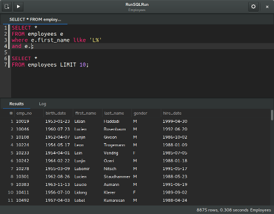

.. RunSQLRun documentation master file, created by
   sphinx-quickstart on Thu Apr 30 21:50:52 2015.
   You can adapt this file completely to your liking, but it should at least
   contain the root `toctree` directive.

RunSQLRun
=========

RunSQLRun is a SQL editor and query tool for Linux.

The following database are supported:

- PostgreSQL
- MariaDB / MySQL
- Oracle
- SQLite

Read the :ref:`getting_started` guide on how to install this
tool and run your first query.

Contents
--------

.. toctree::
   :maxdepth: 2

   tldr
   connecting
   editor
   results
   schema
   shortcuts
   development
